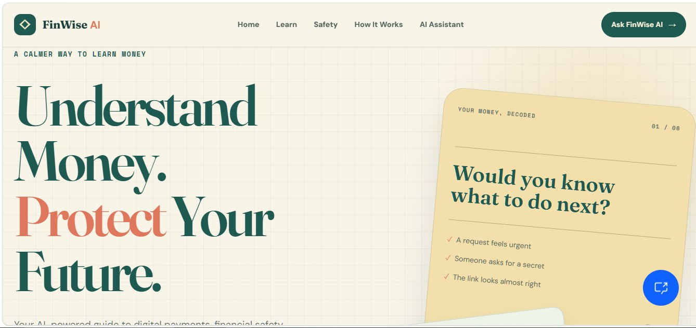
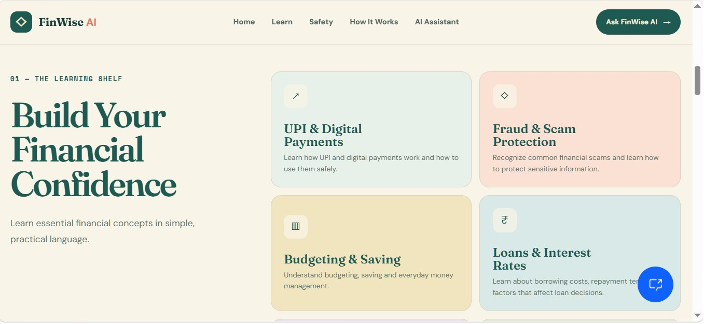
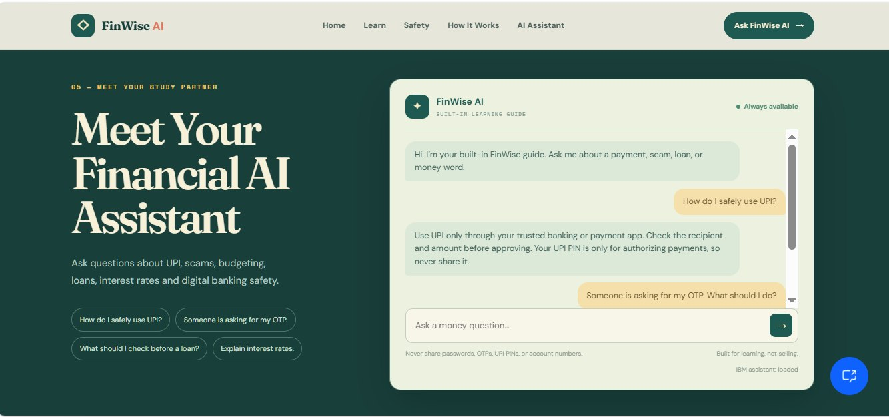
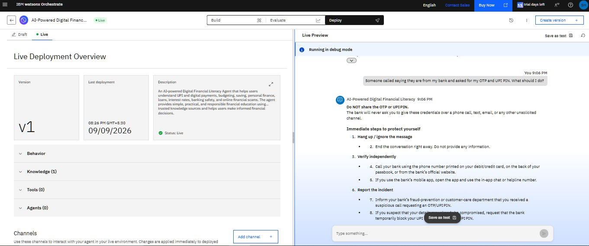
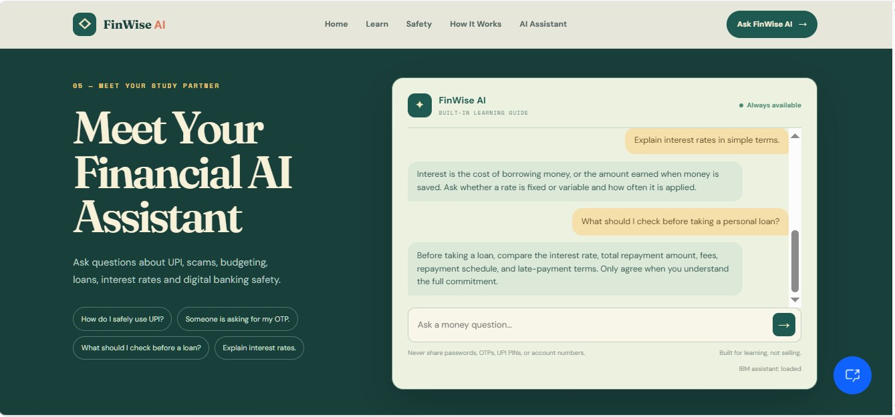
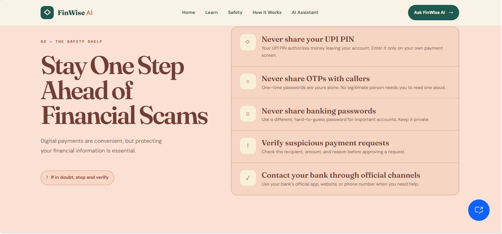
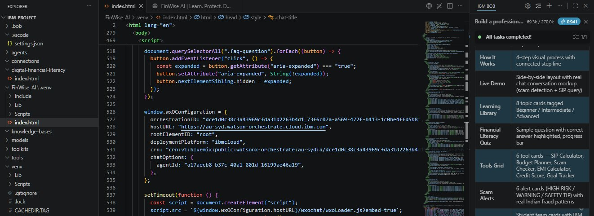

# 💰 FinWise AI – Digital Financial Literacy Agent

### 🤖 Making Digital Finance Simple, Safe & Understandable

> **PS7 – AI Agent for Digital Financial Literacy**

<p align="center">
  
</p>

---

## 🌟 Project Overview

**FinWise AI** is an AI-powered digital financial literacy assistant that helps users understand everyday financial and digital banking concepts in a simple and accessible way.

The project focuses on improving awareness around **digital payments, online scams, budgeting, loans, interest rates, and banking security**.

<p align="center">
  
</p>

---

## 🚨 Problem Statement

Many users face difficulty understanding digital financial services and are increasingly exposed to **online scams, fraudulent transactions, unsafe banking practices, and financial misinformation**.

**PS7** focuses on building an AI agent that can help users develop better digital financial awareness and safer financial habits.

---

## 💡 Proposed Solution

FinWise AI provides a conversational AI-based learning experience that helps users:

* 💳 Understand UPI and digital payments
* 🛡️ Recognize online scams and fraud risks
* 💰 Learn budgeting and saving basics
* 📈 Understand loans and interest rates
* 🏦 Follow safer digital banking practices
* 🔐 Protect OTPs, UPI PINs, and banking credentials

<p align="center">
  
</p>

---

## ✨ Key Features

| 🔹 Feature                | 📌 Purpose                                   |
| ------------------------- | -------------------------------------------- |
| 💳 UPI & Digital Payments | Learn safer digital transactions             |
| 🛡️ Scam Awareness        | Understand common fraud risks                |
| 💰 Budgeting & Saving     | Build basic money-management awareness       |
| 📈 Loans & Interest       | Understand fundamental loan concepts         |
| 🏦 Digital Banking Safety | Learn secure banking practices               |
| 🔐 Credential Safety      | Protect OTPs, UPI PINs & banking credentials |

---

## 🧠 Technology Stack

| Technology                                        | Role                       |
| ------------------------------------------------- | -------------------------- |
| 🤖 **IBM watsonx Orchestrate**                    | AI Agent                   |
| 💻 **IBM Bob**                                    | Project Development        |
| 🌐 **HTML, CSS & JavaScript**                     | Website                    |
| 📚 **Knowledge-based AI / Financial Information** | Financial Literacy Content |

<p align="center">
  
</p>

---

## 🏗️ Simple Architecture

```text
                    👤 USER
                      │
                      ▼
              🌐 FINWISE AI WEBSITE
               HTML • CSS • JavaScript
                      │
                      ▼
          🤖 IBM watsonx Orchestrate
                   AI Agent
                      │
                      ▼
          📚 Financial Information
                      │
                      ▼
             💬 AI-Guided Response
                      │
                      ▼
          🛡️ Safer Financial Awareness
```

---

## 💬 Example User Questions

Users can ask questions such as:

> 💳 **How does UPI payment work?**

> 🛡️ **How can I identify an online scam?**

> 💰 **How should I start budgeting my money?**

> 📈 **What is interest on a loan?**

> 🔐 **Should I share my OTP with someone?**

> 🏦 **How can I stay safe while using digital banking?**

<p align="center">
  
</p>

---

## 🔐 Safety & Responsible AI

FinWise AI is designed for **financial literacy and educational purposes**.

⚠️ It is **not a substitute for professional financial, banking, legal, or investment advice**.

### Never share sensitive information such as:

* ❌ OTPs
* ❌ UPI PINs
* ❌ Passwords
* ❌ Banking credentials
* ❌ Card or security details

Users should verify important financial decisions with their bank or a qualified professional.


<p align="center">
  
</p>

---

## 📂 Project Structure

```text
FinWise-AI/
│
├── index.html
├── README.md
├── Problem_Statement_PS7.pdf
├── AI-Powered Digital Financial Literacy Agent-FinWise AI_Shruti_Halle.pptx
│
├── firstpage.jpg
├── secondpage.jpg
├── thirdpage.jpg
├── forthpage.jpg
├── fifthpage.jpg
├── ibm_watsonx.jpg
└── code_ibm_bob.jpg
```

---

## 💻 IBM Bob Development

<p align="center">
  
</p>

The project was developed using **IBM Bob** and integrates **IBM watsonx Orchestrate** as the AI-agent component.

---

## ▶️ How to Run

### 1️⃣ Clone the repository

```bash
git clone <your-repository-link>
```

### 2️⃣ Open the project

Navigate to the downloaded project folder.

### 3️⃣ Launch the website

Open:

```text
index.html
```

in a web browser.

> ℹ️ The AI-agent functionality depends on the configured IBM watsonx Orchestrate setup.

---

## 🚀 Future Scope

* 🌍 Support for additional languages
* 📚 Expand financial-literacy topics
* 🛡️ Enhanced scam and fraud awareness
* 🎓 More personalized financial-learning experiences
* 📱 Improved accessibility across devices

---

## 👩‍💻 Author

### **Shruti Halle**

**BCA Graduate | Data Analyst | Data Science Learner**

🔗 [LinkedIn](https://www.linkedin.com/in/shruti-halle)

---

<p align="center">

### 💰 FinWise AI

**Learn Finance • Stay Safe • Make Smarter Decisions**

⭐ *PS7 – AI Agent for Digital Financial Literacy*

</p>
